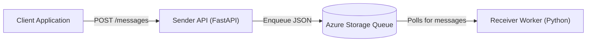

# Azure-QueueBridge

Azure-QueueBridge is a lightweight, scalable, and decoupled event-driven messaging solution built on top of **Azure Queue Storage**. 

It provides a robust architecture for asynchronous processing by separating the ingestion of messages from their actual processing. The project contains a fast HTTP REST endpoint for accepting tasks and a robust background worker for executing them.

## 🏗️ Project Architecture

The system is highly decoupled and consists of two primary, standalone components:

### 1. The Sender API (`/sender`)
A FastAPI-based HTTP service designed to act as a lightweight ingestion endpoint. 
- Accepts incoming JSON payloads.
- Validates requests using an API Key.
- Serializes and enqueues the payloads into Azure Queue Storage.
- Returns a message ID immediately to the client.

👉 **[Read the Sender API Documentation & Setup Guide](./sender/README.md)**

### 2. The Receiver Worker (`/receiver`)
A long-running, resilient Python worker designed for background task processing.
- Continuously polls the Azure Storage Queue for new messages.
- Safely dequeues messages (using visibility timeouts).
- Processes the message (logs it out to stdout/file).
- Deletes the message from the queue upon successful completion to prevent duplicate processing.

👉 **[Read the Receiver Worker Documentation & Setup Guide](./receiver/README.md)**

## ☁️ Why Azure Queue Storage?

This project uses Azure Queue Storage because it is perfectly suited for straightforward asynchronous background processing. 
- **Simplicity:** It's incredibly easy to configure and doesn't carry the heavy operational overhead of Kafka or the complex routing of Azure Service Bus.
- **Scalability:** It can store millions of messages, allowing your application to absorb massive traffic spikes without dropping requests.
- **Decoupling:** It completely separates the web layer (FastAPI) from the processing layer, allowing each to be scaled independently.

## 🚀 Getting Started

To get started with running the project locally or via Docker, please refer to the individual module documentation linked above. Each folder contains its own `README.md` with complete instructions for environment configuration, running the code, and interacting with the system.

## 📜 License & Contribution
- Distributed under the MIT License. See `LICENSE` for more information.
- See `CONTRIBUTING.md` for guidelines on contributing to this project.
- See `CODE_OF_CONDUCT.md` and `SECURITY.md` for other vital repository policies.
