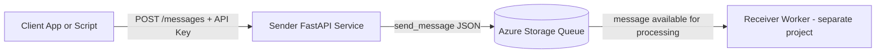

# Sender API (Azure Storage Queue)

## What This Project Is About

This sender project is a FastAPI-based HTTP service that accepts JSON requests and writes them into an Azure Storage Queue.

In simple terms:

1. A client sends JSON to this API.
2. The API validates an API key.
3. The API serializes the JSON and enqueues it in Azure Queue Storage.
4. The API returns the queue message ID.

This sender can be used as a lightweight ingestion endpoint in event-driven systems.

## Azure Services Used

The sender uses the following Azure service:

1. Azure Storage Account (Queue Storage feature)
   Purpose: stores messages in a queue for downstream processing.

No other Azure services are required by the sender itself.

## Required Permissions

If you use a connection string with Account Key (current setup), the key grants access to queue operations in that storage account.

Minimum queue operations needed by this sender:

1. Create queue (when queue does not exist)
2. Add/enqueue message
3. Read queue metadata (implicitly during SDK operations)

Important:

1. Protect the account key as a secret.
2. Rotate keys regularly.
3. For production, prefer least-privilege SAS or Microsoft Entra ID with RBAC instead of full account key when possible.

## How To Get The Queue Connection String

From Azure Portal:

1. Open your Storage Account.
2. Go to Security + networking, then Access keys.
3. Pick key1 or key2.
4. Copy the Connection string.
5. Put it into AZURE_STORAGE_CONNECTION_STRING in your sender .env file.

Example format:

```text
DefaultEndpointsProtocol=https;AccountName=<your-account>;AccountKey=<your-key>;EndpointSuffix=core.windows.net
```

## Architecture



Runtime behavior in sender:

1. On startup, sender loads environment variables and initializes Azure Queue client.
2. Sender ensures the queue exists.
3. On each POST /messages call, sender validates API key and enqueues payload.

## Project Requirements

### Local Development Requirements

1. Python 3.12+
2. uv (Python package and project manager)
3. Azure Storage Account with Queue Storage enabled
4. Network access from your machine/container to Azure Storage endpoint

### Python Dependencies

Defined in pyproject.toml:

1. fastapi
2. uvicorn[standard]
3. azure-storage-queue
4. python-dotenv

### Optional Runtime Requirements

1. Docker (if running containerized)
2. curl or PowerShell Invoke-RestMethod for testing API calls

## Environment Variables

Create sender/.env from sender/.env.example and set values.

For public GitHub repositories:

1. Commit sender/.env.example.
2. Never commit sender/.env (contains secrets).
3. If a secret was ever committed, rotate it immediately and remove it from git history.

### Required Variables

| Variable | Meaning | Notes |
|---|---|---|
| AZURE_STORAGE_CONNECTION_STRING | Full Azure Storage connection string | Recommended approach for this sample |
| AZURE_STORAGE_QUEUE_NAME | Queue name used by sender | Queue is auto-created if missing |
| API_KEY | Shared secret required by API endpoints | Use a strong random value |

### Alternative to Connection String

If AZURE_STORAGE_CONNECTION_STRING is not set, sender can build one from:

1. AZURE_STORAGE_ACCOUNT_NAME
2. AZURE_STORAGE_ACCOUNT_KEY
3. AZURE_STORAGE_ENDPOINT_SUFFIX (default core.windows.net)

### Optional Variables

| Variable | Default | Meaning |
|---|---|---|
| API_KEY_HEADER_NAME | X-API-Key | Header name to read API key from |
| PORT | 8000 | HTTP port for FastAPI/uvicorn |
| MESSAGE_TTL_SECONDS | 3600 | Message lifetime in queue before auto-delete |
| AZURE_SDK_TIMEOUT_SECONDS | 30 | Azure SDK HTTP timeout (seconds) |
| AZURE_SDK_RETRY_TOTAL | 5 | Retry attempts for transient failures |
| AZURE_SDK_RETRY_BACKOFF_FACTOR | 0.8 | Retry backoff factor |
| AZURE_SDK_RETRY_BACKOFF_MAX | 30 | Maximum retry backoff (seconds) |
| LOG_LEVEL | INFO | Logging verbosity |

### Important Variable Notes

1. MESSAGE_TTL_SECONDS is not visibility timeout.
   It controls how long a message exists in the queue before Azure auto-deletes it.
2. API_KEY must match exactly what clients send in the configured API key header.
3. For Docker --env-file, do not wrap values in quotes.
   Docker treats quotes as literal characters.
4. Queue names must follow Azure rules: lowercase letters, digits, hyphens, length 3-63.

## How To Run This Project

### Run Locally (without Docker)

From sender:

```powershell
uv sync
```

Start API (option 1):

```powershell
uv run sender_api.py
```

Start API (option 2):

```powershell
uv run uvicorn sender_api:app --host 0.0.0.0 --port 8000
```

### Run With Docker

From repository root:

```powershell
docker build -t stg-msg-queue-sender:local -f sender/Dockerfile sender
docker run --rm -p 8000:8000 --env-file sender/.env stg-msg-queue-sender:local
```

If you changed sender code, rebuild image before running again.

## API Endpoints

| Method | Path | Description | Authentication |
|---|---|---|---|
| GET | /health | Health check endpoint | Required |
| POST | /messages | Enqueue a JSON payload | Required |

## How To Send A Message

### Request Rules

1. Method: POST
2. URL: http://localhost:8000/messages
3. Content-Type: application/json
4. API key header: X-API-Key (or your configured API_KEY_HEADER_NAME)
5. Body: any valid JSON object

### Message Format

There is no fixed schema in sender code.
Any valid JSON object is accepted and serialized as-is into the queue.

Example JSON body:

```json
{
  "event_type": "order.created",
  "order_id": "A-1001",
  "amount": 49.95,
  "customer": {
    "id": "C-9",
    "name": "Alex"
  }
}
```

### PowerShell Example

```powershell
Invoke-RestMethod -Uri http://localhost:8000/messages `
  -Method POST `
  -ContentType "application/json" `
  -Headers @{ "X-API-Key" = "your-api-key" } `
  -Body '{"event_type":"order.created","order_id":"A-1001","amount":49.95}'
```

### curl Example

```bash
curl -X POST http://localhost:8000/messages \
  -H "Content-Type: application/json" \
  -H "X-API-Key: your-api-key" \
  -d '{"event_type":"order.created","order_id":"A-1001","amount":49.95}'
```

### Success Response

```json
{
  "message_id": "xxxxxxxx-xxxx-xxxx-xxxx-xxxxxxxxxxxx"
}
```

### Common Error Responses

| Status | Meaning | Typical Cause |
|---|---|---|
| 401 | Authentication failed | Missing or invalid API key |
| 422 | Validation error | Request body is not valid JSON object |
| 502 | Queue send failure | Azure SDK/storage issue or connectivity problem |

## Health Check Example

```powershell
Invoke-RestMethod -Uri http://localhost:8000/health `
  -Headers @{ "X-API-Key" = "your-api-key" }
```

Expected response:

```json
{
  "status": "ok"
}
```

## License

This project is licensed under the MIT License.
See LICENSE in the repository root for full text.

## Security

If you discover a vulnerability, do not post it publicly in issues.
See SECURITY.md in the repository root for responsible disclosure guidance.
